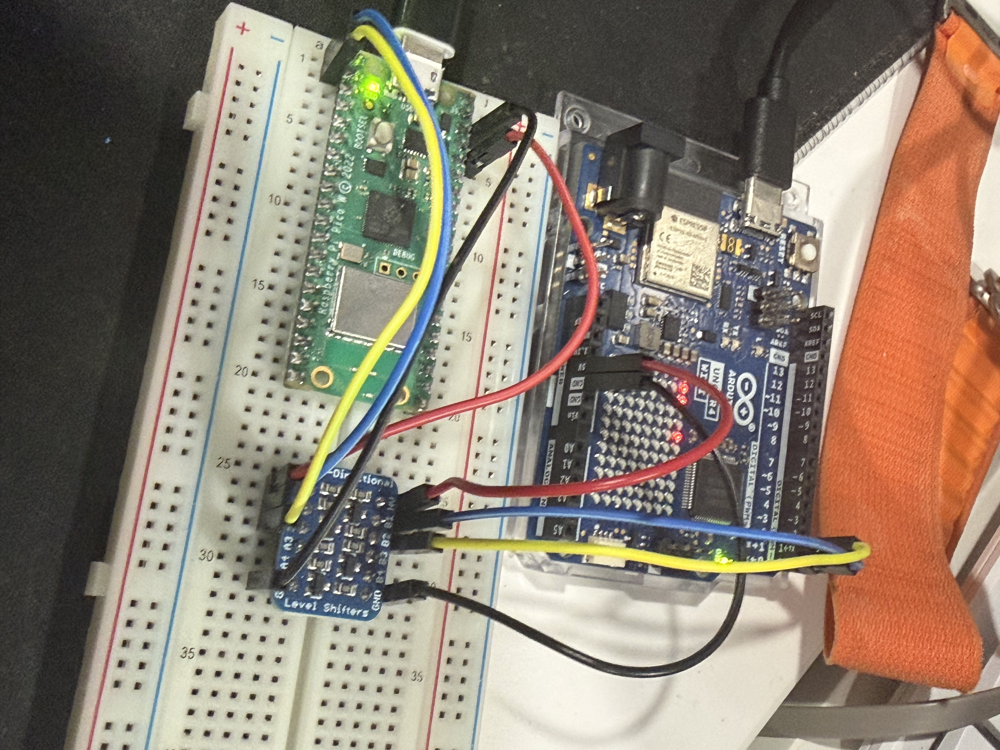
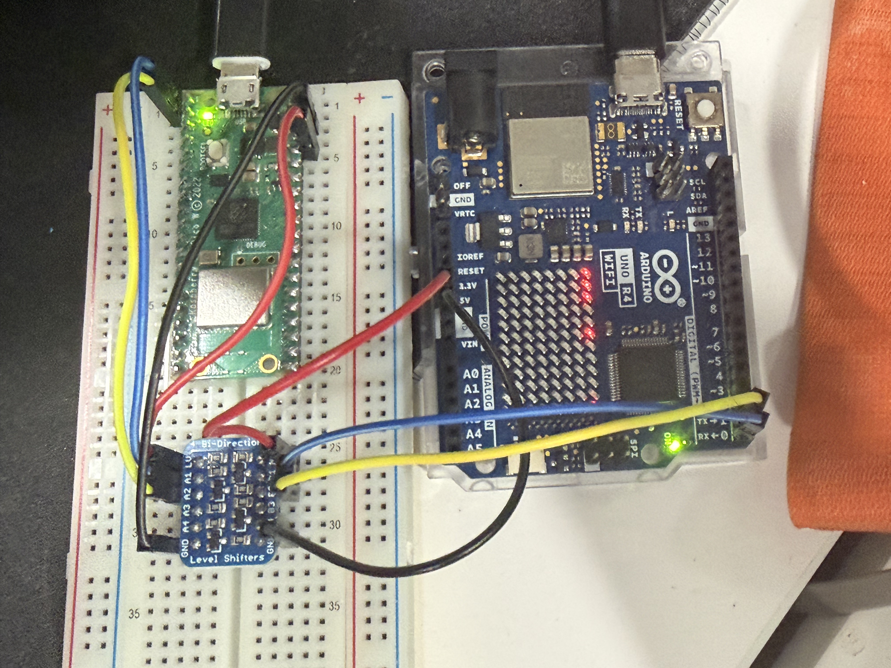
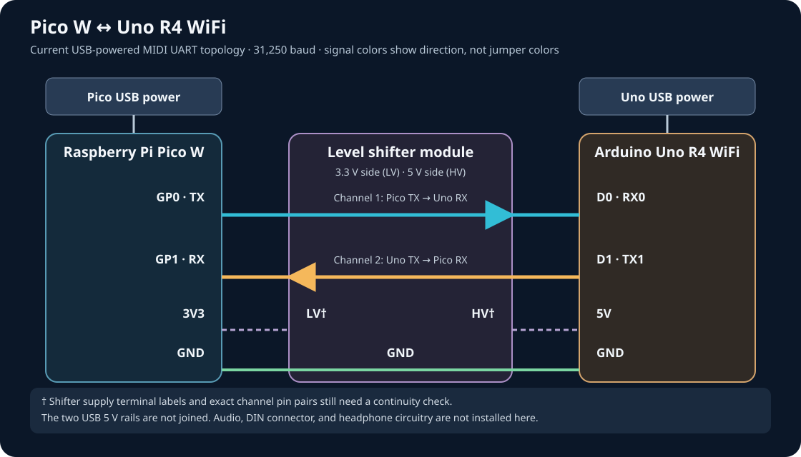
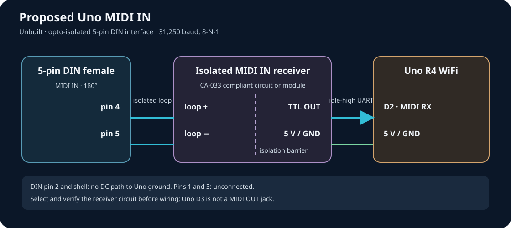
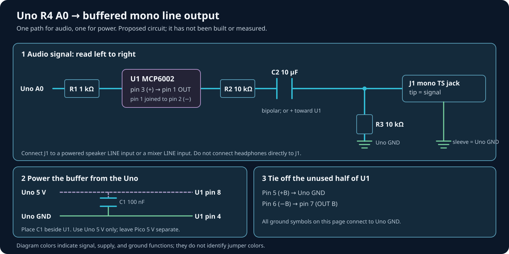
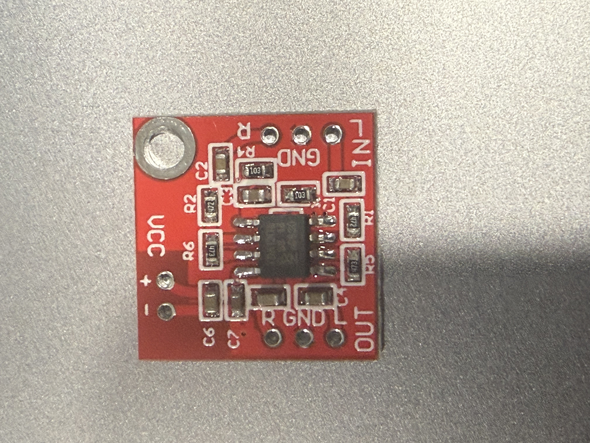
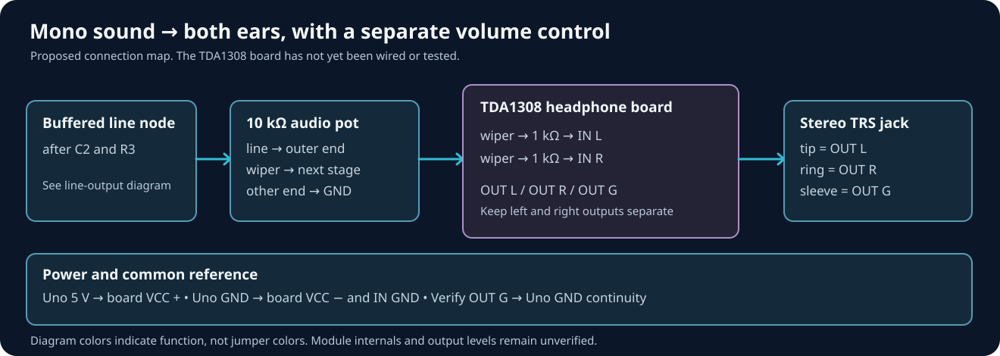
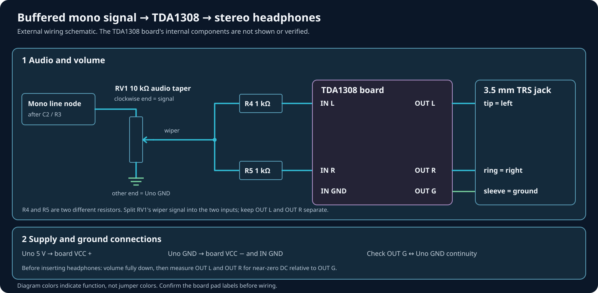

# How QuarkWave is connected

This guide begins with the breadboard that exists today, then shows the two additions planned for a self-contained instrument: a conventional MIDI IN and a buffered audio output. The drawings use the same visual language so you can follow power, MIDI, and audio without tracing a tangle of crossing arrows.

**Current build:** Pico W and Uno R4 WiFi, two USB power cables, a shared ground, and a bidirectional MIDI UART through a level-shifter module. **Planned additions:** a physical DIN input, a buffered mono line jack, and an optional headphone amplifier. The photographed breadboard has no A0 audio jack yet.

## The current setup

*The two boards use their own USB power cables.*

*Wire colors help in a photograph, but the schematic below is the useful connection map.*

The Pico sends MIDI from **GPIO 0 TX** to the Uno's **RX0/D0**. The Uno answers from **TX1/D1** to **GPIO 1 RX** through a **5 V-to-3.3 V level shifter**. The two boards share ground, while their 5 V USB supply rails stay separate. MIDI runs at **31,250 baud** in both directions. The return wire is what lets the Pico recognize an Uno that has finished starting and receive patch acknowledgments.

The owner has confirmed the return path and level shifter. The photographs do not resolve the module's exact channel numbers or prove a voltage at each jumper. When turning the prototype into a fixed build, record the actual LV/HV terminals and continuity for both directions. [Pico UART](../QuarkWave_UI_MIDI/QuarkWave_UI_MIDI.ino), [Uno UART](../QuarkWave_MIDI/QuarkWave_MIDI.ino).

## Proposed physical DIN MIDI IN for standalone Uno use

The Uno firmware listens for MIDI on **D2** through a software-serial receiver. To attach a standard five-pin MIDI controller, add an **opto-isolated MIDI IN** circuit. Do not connect a DIN jack directly to D2. The drawing shows the intended boundary between the MIDI current loop and the Uno's logic side.

| Part of the input | Connection to make |
| --- | --- |
| DIN jack | Use a female five-pin, 180° jack labeled **MIDI IN**. Pins **4** and **5** feed the isolated receiver according to that circuit's polarity. Check the actual jack datasheet: front and rear views are easy to reverse. |
| Isolation | Use a MIDI IN receiver designed for the [MIDI 1.0 electrical specification](https://www.midi.org/wp-content/uploads/wpforo/default_attachments/1709416667-ca33-MIDI-10-Electrical-Specification-Update.pdf), with current limiting and reverse-voltage protection. The input loop remains electrically isolated from the Uno. |
| Uno side | The receiver's idle-high, 5 V logic output goes to **D2**. Power its logic side from Uno 5 V and GND. |
| Other DIN contacts | Leave pins **1** and **3** unconnected. Do not make a DC connection from pin **2** or the jack shield to Uno ground. |
| Uno D3 | Configured as software-serial TX, but no MIDI OUT or THRU is built. Do not wire D3 directly to a DIN jack. |

Build with USB unplugged. Check the receiver supply polarity, jack pin numbering, isolation, and idle-high output at D2 before sending a note from a known controller. The [external MIDI guide](external-midi-guide.md) describes how the Uno behaves without the Pico.

## Proposed mono line output from Uno A0

The Uno's **A0** pin is a 12-bit DAC output, not a ready-made audio jack. The circuit below buffers it with an MCP6002 op amp, removes its DC offset, and delivers a reduced **mono line-level signal** to a powered speaker's *line input* or a mixer. It is not a passive-speaker or headphone driver.

**MCP6002** is a separate chip to add to the breadboard. A through-hole **MCP6002-I/P** is convenient for a prototype. One half acts as a unity-gain buffer: it protects the DAC from the cable and destination load without intentionally boosting voltage. The other half is tied off so its inputs do not float. Check the [Microchip package pinout](https://www.microchip.com/en-us/product/MCP6002) before wiring a different package.

| Part | Value and connection |
| --- | --- |
| **U1** | MCP6002 dual op amp, DIP-8 pinout. Pin 8 → Uno 5 V; pin 4 → Uno GND. Use the Uno's USB-derived 5 V, not the Pico's 5 V rail. |
| **C1** | 100 nF ceramic from U1 pin 8 to pin 4, placed close to the chip. |
| **R1 and buffer** | 1 kΩ from Uno A0 to U1 pin 3 (`+A`). Join U1 pin 2 (`−A`) to pin 1 (`OUT A`). |
| **Unused half** | Join U1 pins 6 (`−B`) and 7 (`OUT B`); connect pin 5 (`+B`) to Uno GND. |
| **R2** | 10 kΩ from U1 pin 1 to C2. |
| **C2** | 10 µF coupling capacitor. A bipolar part is simplest. If polarized, its positive side faces U1/R2 and its negative side faces the jack. |
| **R3** | 10 kΩ from the jack side of C2 to Uno GND, providing a DC reference and output divider with R2. |
| **J1** | Mono TS jack: tip to the jack side of C2; sleeve to Uno GND. Connect to a line input with a short shielded cable. |

The DAC signal is centered above ground inside the Uno. **C2 removes that DC offset** before the line input. Buffering matters because the DAC's permitted load is much lighter than a headphone or cable load; see the [Arduino Uno R4 datasheet](https://docs.arduino.cc/resources/datasheets/ABX00087-datasheet.pdf) and [RA4M1 DAC data](https://www.renesas.com/en/document/dst/ra4m1-group-datasheet). R2/R3 give about half the buffered AC voltage into a high-impedance line input and about a third into a 10 kΩ mixer input. Those are circuit estimates, not measured levels on this build.

### Build and first-power checks

1. Unplug both USB cables. Assemble the circuit and connect its supply only to the **Uno**. Keep the existing Pico–Uno ground and level shifter as they are.
2. Before attaching a mixer or powered speakers, check continuity: jack sleeve to Uno GND, U1 pin 8 to Uno 5 V, and U1 pin 4 to Uno GND. Check for a 5 V-to-ground short and confirm C2 polarity if it is electrolytic.
3. Power the Uno by USB. Measure approximately 5 V across U1 pins 8 and 4. After C2 settles, the jack tip should have **near-zero DC** relative to sleeve. If substantial DC remains, disconnect the destination and fix the circuit.
4. Start with low input gain and speaker level. Play a note and raise the level gradually. Record the actual jack voltage and any hum or clipping in the [hardware test log](hardware-test-log.md).

A stereo aux input needs a deliberate mono-to-stereo feed; do not join its left and right contacts or outputs together. Headphones need the amplifier below.

## Proposed headphones with the owner's TDA1308 board

The owner has a [TDA1308 headphone amplifier module](https://www.amazon.ca/dp/B0GVTKNFDS). Its photo shows `VCC +/−`, `IN L/GND/R`, and `OUT L/G/R` pads. The board's internal component values and gain are not legible, so the drawing treats it as a module, not as a known internal circuit. The [TDA1308 datasheet](https://www.nxp.com/docs/en/data-sheet/TDA1308.pdf) describes the chip; check the actual board's supply and output behavior before connecting headphones.

Feed the headphone board from the **buffered, AC-coupled node after C2/R3**, never directly from A0. Send that mono signal to both *inputs*, while keeping the left and right *outputs* separate. Add a physical input volume knob because the Uno's master-gain control does not reach zero.

| From | To |
| --- | --- |
| Node after C2/R3 | One outer terminal of a **10 kΩ audio-taper potentiometer**; the other outer terminal to Uno GND. |
| Potentiometer wiper | Two separate **1 kΩ resistors** to module `IN L` and `IN R`. |
| Uno GND | Module `IN GND` and `VCC −`. Check continuity from `OUT G` to this ground before attaching a jack. |
| Uno 5 V | Module `VCC +`; keep the Pico supply separate. |
| Module `OUT L`, `OUT R`, `OUT G` | Stereo TRS jack **tip**, **ring**, **sleeve**. Never join `OUT L` and `OUT R`. |

With headphones unplugged and the knob fully down, power the module and measure DC from each output to `OUT G`. Both outputs should settle near zero. If either holds substantial DC, stop and inspect the wiring. Then test with inexpensive headphones at minimum level. The line jack remains the better connection for powered speakers or a mixer.

## What remains to build

The current photos establish the inter-board arrangement, while the DIN, line, and headphone drawings are designs for the next hardware step. Before calling any of those drawings as-built, record the exact shifter pin map and Pico RX voltage; choose and test the DIN receiver; measure DC and signal level at the new line jack; and check the headphone module's output DC and actual gain. The [hardware test log](hardware-test-log.md) is the place for those measurements.
