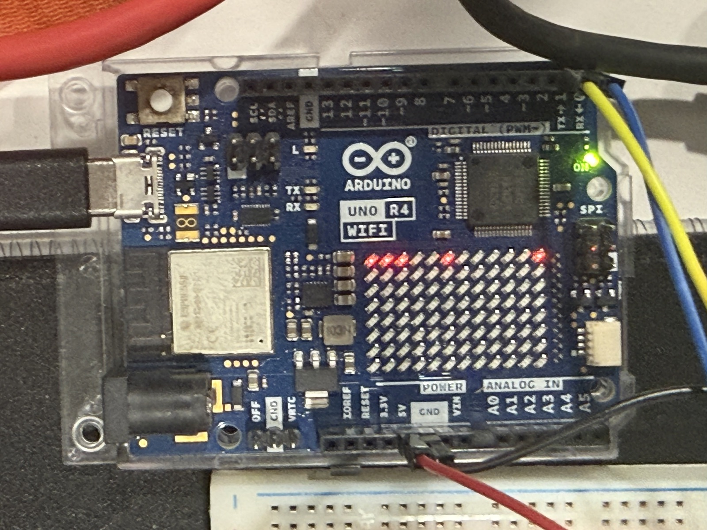
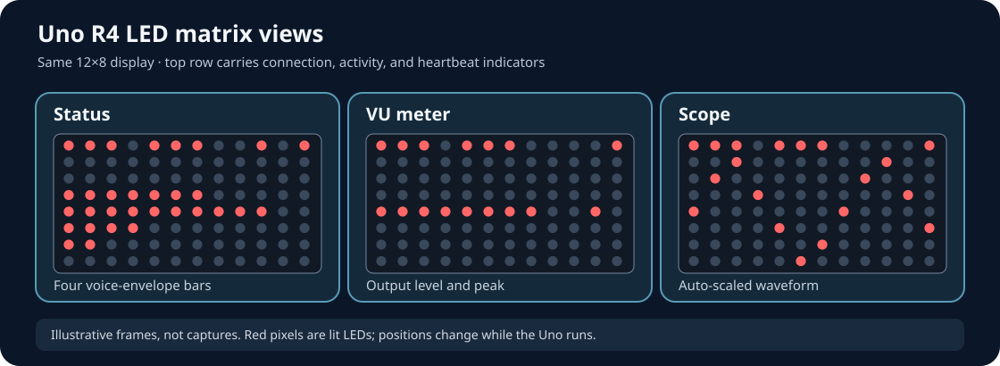
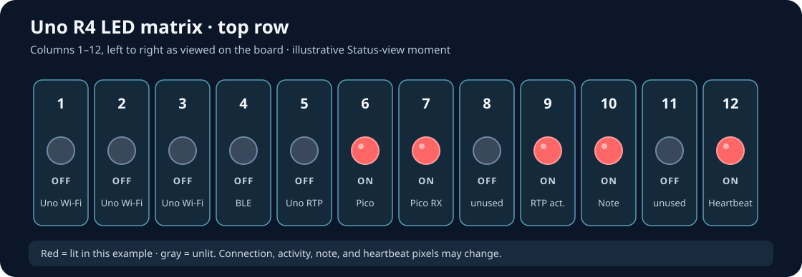

# Reading the Uno LED display

The Uno R4 WiFi has a **12-column × 8-row red LED matrix**. It gives a quick view of connectivity and activity while you play. The green **ON** light and the small board **TX/RX** lights in the photograph are separate board LEDs, not pixels in the red matrix.

**Evidence:** the photograph below shows the owner's powered Uno on 2026-09-23. The meanings and examples on this page are **source-reviewed** against the current Uno firmware. A still photograph cannot establish which of the momentary activity or heartbeat pixels were on at a particular instant. A targeted two-board check confirmed view selection and internal envelope/VU values for a browser note; visual appearance has not been checked against a new live photograph, and Uno audio output remains untested. [Matrix implementation](../QuarkWave_MIDI/QuarkWave_MIDI.ino), [hardware test log](hardware-test-log.md).

*Live development build. The bright top-row pixels are a snapshot of indicators that can change within fractions of a second.*

## Choose a view

In the browser panel, open **Explore** or **All controls**, find **LED matrix**, and choose **Status**, **VU meter**, or **Scope**. These change only the Uno display; they do not change the sound. Status is the default after boot or a synth reset. The selector sends Pico-to-Uno Program Changes **10**, **11**, and **12** respectively. The Uno briefly shows **ST**, **VU**, or **SC** without stopping note processing, then returns to the selected display. These display commands are accepted only on the Pico UART, not on the separate DIN or RTP-MIDI inputs. [Browser control](../QuarkWave_UI_MIDI/QuarkWave_UI.h), [Uno display selection](../QuarkWave_MIDI/QuarkWave_MIDI.ino).

*Illustrative frames, not captures. Lit pixels vary with network traffic, notes, waveform, and the heartbeat.*

| View | What the lower rows show | Useful when |
| --- | --- | --- |
| **Status** | Up to four horizontal bars, one for each synth voice. Each bar follows that voice's envelope level. | Checking which voices are active or releasing. |
| **VU meter** | One horizontal bar on the fifth row, plus a peak pixel. It follows the firmware's synthesized output level before the DAC. | Seeing relative output movement while playing. |
| **Scope** | A moving, automatically scaled trace with one dot per column. It samples the synthesized output before the DAC. | Seeing the shape and movement of the generated waveform. |

**VU** and **Scope** are visual guides, not calibrated level meters or measurements at the audio jack. Because the audio output stage is not assembled yet, their real-world relationship to a mixer or headphones remains untested. [Output sampling and display calculations](../QuarkWave_MIDI/QuarkWave_MIDI.ino), [connection guide](connection-guide.md).

## The top row stays useful in every view

Count columns **1–12 from left to right as viewed on the board**. The firmware draws these indicators on the top row in all three views. A pixel marked “brief” is expected to flash and go dark; it does not represent a persistent fault.

- **1–6:** `1–3` Wi-Fi · `4` BLE-MIDI · `5` RTP-MIDI · `6` Pico link
- **7–12:** `7` Pico RX · `8` unused · `9` RTP RX · `10` note · `11` unused · `12` heartbeat

| Column | Meaning in this build | When it lights |
| ---: | --- | --- |
| 1–3 | Uno Wi-Fi | Together while the Uno Wi-Fi stack reports connected. |
| 4 | BLE-MIDI | Never in this build; BLE-MIDI is disabled. |
| 5 | RTP-MIDI | While an RTP session reports connected. |
| 6 | Pico link | While the Uno has received a Pico readiness request within roughly 3.5 seconds. This is a handshake indicator, not merely a powered UART. |
| 7 | Pico UART receive, brief | For about 200 ms after a MIDI message arrives from the Pico. |
| 8 | Unused | Off. |
| 9 | RTP receive, brief | For about 300 ms after the Uno receives RTP MIDI activity. |
| 10 | Note flash in Status view | For about 400 ms after a synth note starts. This flash is not drawn in VU or Scope. |
| 11 | Unused | Off. |
| 12 | Heartbeat | Toggles about every 250 ms; a regular blink shows the display loop is updating. |

The **bottom-right pixel** is a timing diagnostic. It can light for a frame if more than 200 ms elapsed between LED updates, such as after a blocking operation. An occasional flash alone does not identify its cause. [Top-row and diagnostic overlays](../QuarkWave_MIDI/QuarkWave_MIDI.ino).

## What happens at startup

The matrix first plays a boot animation and scrolls **QuarkWave**. While Wi-Fi starts, a two-pixel “comet” moves across the fourth row. The Uno then scrolls its IP address or **No WiFi**. An RTP connection briefly shows **RT**. Changing the display view briefly shows **ST**, **VU**, or **SC**; the regular matrix view resumes after about 450 ms. Startup text still scrolls. [Boot animation](../QuarkWave_MIDI/QuarkWave_MIDI.ino), [Wi-Fi display](../QuarkWave_MIDI/QuarkWave_MIDI.ino), [RTP notification](../QuarkWave_MIDI/QuarkWave_MIDI.ino).

## Quick checks

- **Heartbeat blinks, Pico pixel is dark:** the display loop is running, but the Uno has not received a recent Pico readiness request. Check the browser's separate Pico and Uno connection labels and the inter-board wiring. The Pico-to-Uno link can be offline even while Uno Wi-Fi is connected.
- **Wi-Fi group is dark:** the Uno firmware does not currently report Wi-Fi connected. It can still play from its other available MIDI inputs, subject to their wiring.
- **Voice bars move but VU seems still:** switch to VU and play again. Status follows individual voice envelopes; VU follows the final synthesized output, so they are not identical.
- **A short mode label is showing:** wait about half a second for the selected view to resume. Startup text can take longer to scroll.

These are reading aids, not a substitute for checking MIDI reception and audio on the assembled instrument. [Pico–Uno connection behavior](technical-guide.md#patch-lifecycle-and-storage), [hardware test log](hardware-test-log.md).
