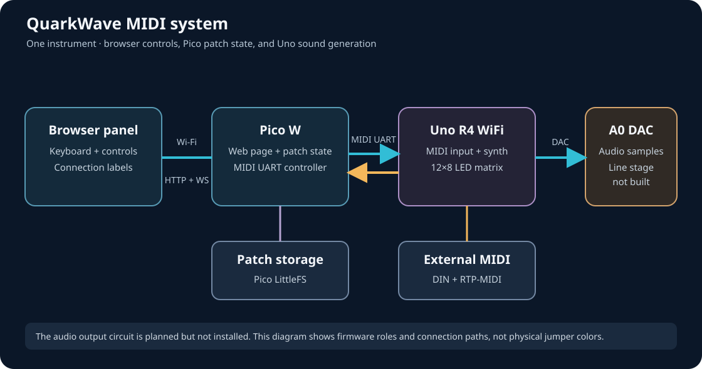
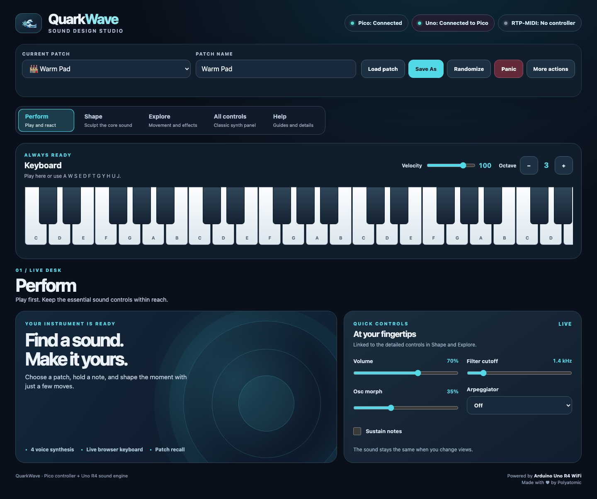
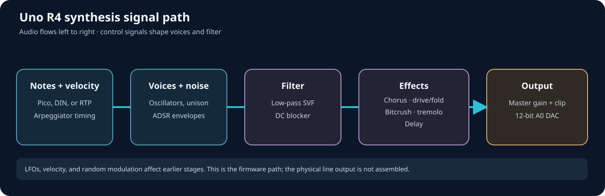

# QuarkWave MIDI: technical guide

**For:** developers, integrators, and technically curious synth programmers.  
**Status:** source-reviewed, partial browser hardware check (firmware snapshot: 2026-09-23). The [documentation index](README.md) records exact source hashes. Treat this as a description of this build, not a protocol stability promise.

## System at a glance

The assembled controller tested on 2026-09-23 is a Pico W (RP2040). The Pico serves the panel and stores patches; the Uno holds live synthesis state and generates audio. Browser traffic uses HTTP and WebSocket, the boards exchange MIDI at 31,250 baud, and the Uno outputs audio through its A0 DAC. Both sketches connect to Wi-Fi, but this build serves the browser page from the Pico. [Pico setup](../QuarkWave_UI_MIDI/QuarkWave_UI_MIDI.ino), [Uno setup](../QuarkWave_MIDI/QuarkWave_MIDI.ino).

### Connections and build flags

The deployed Pico W build uses `rp2040:rp2040:rpipicow:flash=2097152_1048576` to match its existing 1 MB LittleFS partition. A full flash backup was taken before uploading.

| Connection | Source-defined wiring or setting |
| --- | --- |
| Pico → Uno | Pico GPIO 0 (TX) to Uno R4 hardware UART RX (`RX0`/D0), apparently through one channel of the photographed level shifter; MIDI serial at 31,250 baud. Exact channel endpoints are not continuity-checked. |
| Uno → Pico | Uno UART TX (`TX1`/D1) to Pico GPIO 1 (RX) **through a separate 5 V-to-3.3 V level-shifter channel**, with common ground. This return path is required for connection detection, startup sync, and acknowledgments. The project owner has confirmed this wiring and level shift; this review did not independently measure the signal. |
| Audio | Uno `A0` 12-bit DAC, initialized once with `analogWrite` and then fed through its data register, at a nominal 22,050-sample/s synthesis rate. `A0` is not yet connected to an audio jack; the [connection guide](connection-guide.md#proposed-mono-line-output-from-uno-a0) has an unbuilt buffered mono line-output proposal. |
| Separate MIDI input | Uno `SoftwareSerial(2, 3)` creates `DIN_MIDI`; the physical connector and interface circuit need hardware documentation. |
| Network MIDI | `USE_RTP_MIDI=1`, Wi-Fi stack on, AppleMIDI instance named `QuarkWave` at port `5004`. |
| Bluetooth MIDI | `USE_BLE_MIDI=0`; code exists behind a build flag but is **not active in this snapshot**. |

[Pico wiring comment and UART setup](../QuarkWave_UI_MIDI/QuarkWave_UI_MIDI.ino), [Uno build flags and MIDI instances](../QuarkWave_MIDI/QuarkWave_MIDI.ino), [Uno DAC](../QuarkWave_MIDI/QuarkWave_MIDI.ino).

The photographed development build currently powers the Pico W and Uno separately through their USB ports. The owner confirms a level-shifted Uno TX return wire and common ground; exact jumper endpoints and Pico RX voltage still need a continuity/voltage check. See the [as-built inter-board schematic, hardware photographs, and wiring record](connection-guide.md#the-current-setup).

## Uno LED matrix

The Uno's 12×8 matrix has three Pico-selected modes: **Status** shows four voice-envelope bars, **VU** shows a bar and peak from the synthesized output level, and **Scope** plots an automatically scaled trace of output samples. All three retain the top-row Wi-Fi, RTP, Pico handshake, receive-activity, and heartbeat indicators. A bottom-right pixel indicates an LED update interval over 200 ms. Boot text scrolls; view changes scroll the full **Viz: Status**, **Viz: VU**, or **Viz: Scope** label, and an RTP connection scrolls **RTP Connected**. These runtime labels advance one frame at a time without blocking the audio loop. The [LED display guide](led-display-guide.md) has a live photograph, labeled indicator table, and illustrative frames. These meters derive from firmware samples before the DAC; they are not calibrated measurements of the unbuilt audio output stage. [Uno matrix code](../QuarkWave_MIDI/QuarkWave_MIDI.ino).

## Browser ↔ Pico interface

The Pico returns the embedded HTML page at `GET /`, exposes `GET /api/patches` and `GET /api/mdns`, and runs a separate WebSocket server on port `8081`. The mDNS name is `quarkwave.local` when discovery starts successfully. WebSocket messages are JSON. The Pico accepts the discriminator as `type` or `t`; the active browser handlers use `type`. [HTTP routes](../QuarkWave_UI_MIDI/QuarkWave_UI_MIDI.ino), [WebSocket handler](../QuarkWave_UI_MIDI/QuarkWave_UI_MIDI.ino), [browser client](../QuarkWave_UI_MIDI/QuarkWave_UI.h).

| Browser → Pico | Fields | Pico action |
| --- | --- | --- |
| `getPatchList` | — | Broadcasts user and factory patch metadata. |
| `control` | `param` string, `value` number/Boolean | Converts to the effective MIDI step, updates Pico's current patch fields where applicable, then sends MIDI CC, Program Change, or SysEx. |
| `randomize` | — | Pico generates one complete live patch across the valid MIDI ranges, sends it to Uno, then returns `patchData`. Patch selection, sustain pedal, and browser keyboard velocity are excluded. |
| `noteOn` | `note` 0–127, optional `velocity` 1–127 | Tracks this browser client's ownership and sends Note On to Uno when the first client holds the note. |
| `noteOff` | `note` 0–127 | Releases ownership and sends Note Off when the last client releases it. Disconnect releases that client's notes. |
| `loadPatch` | `index` 0–7 or 100+ | Loads a user file or factory preset, broadcasts patch data, then sends its controls to Uno. |
| `savePatch` | `index` 0–7, `name`, `overwrite` Boolean | Saves the live patch to a user slot. Occupied slots require `overwrite: true`; factory indexes are rejected. Names are truncated to 16 characters. |
| `commitPatch` / `loadCommitPatch` | — | Saves or restores a separate snapshot; the save path also writes a backup. |
| `visualization` | `mode` 0–2 | Sends Uno Program Change 10–12 for Status, VU, or Scope. |
| `panic` | — | Sends CC120 All Sound Off and clears tracked browser-note ownership. |
| `syncUno` | — | Explicitly resets the Uno and sends the Pico's current patch, including when the Uno has been used standalone. The browser presents a warning first. |

| Pico → browser | Relevant fields | Purpose |
| --- | --- | --- |
| `patchList` | `userPatches`, `factoryPatches` | Populates the selector. A user slot's `exists` flag reflects physical file occupancy, including unreadable files. Factory indexes start at 100 and have `readonly: true`. |
| `patchData` | `patch` object | Repaints controls from the current Pico patch. |
| `currentPatch` | `index` | Updates the selected factory or user patch. |
| `patchSaveResult` | `success`, `index`, optional `error` | Gives the requesting browser the result of a save. Only a successful save changes the live name and selected slot. |
| `commitSaved` / `commitLoaded` | `name` | Confirms snapshot operations in the browser's patch action status. |
| `unoStatus` | `connected`, `syncing`, `syncFailed`, `mode` | Reports the independent Uno link state. `mode` is `offline`, `syncing`, `standalone`, `pico`, or `unsynced`. |

The browser presents one live instrument through **Perform**, **Shape**, **Explore**, and **All controls** tabs. The keyboard and patch strip remain mounted as tabs change, and the selected tab is saved only in browser `localStorage` (`quarkwave-view`). Perform's quick controls mirror the corresponding detailed controls. All controls moves the existing Shape and Explore cards into one scrollable panel and moves them back when another tab is selected; it does not clone inputs or create duplicate control IDs. Tab selection itself sends no WebSocket message. [Embedded panel](../QuarkWave_UI_MIDI/QuarkWave_UI.h).

*Panel reference generated from the UI source. The connected state is illustrative; Pico-to-Uno communication and audio output remain hardware untested. See the [musician guide](user-guide.md) for Shape, Explore and All controls views.*

The **Pico** label reflects the browser WebSocket connection. The **Uno** label reflects replies to Pico readiness requests on the return MIDI wire; this establishes a responding firmware link, but does not prove audio output. `standalone sound` means a DIN or RTP note, CC, pitch bend, or accepted QuarkWave sound command was received since the last Pico patch transfer. Clock and transport messages alone do not mark standalone sound. [Browser status](../QuarkWave_UI_MIDI/QuarkWave_UI.h), [Pico link handling](../QuarkWave_UI_MIDI/QuarkWave_UI_MIDI.ino).

## Pico ↔ Uno MIDI contract

The Pico sends channel-1 messages on its hardware `Serial1`; the Uno's `PICO_MIDI` receiver listens omni. The Uno also listens to a separate software-serial MIDI input and RTP-MIDI. Note On/Off, CC, and pitch bend are registered for all three paths. The Pico UART accepts the full QuarkWave Program Change and SysEx set. DIN and RTP also accept the sound-related subset described below. MIDI Clock and transport handlers are registered for DIN and RTP, not the Pico UART. [Pico serial](../QuarkWave_UI_MIDI/QuarkWave_UI_MIDI.ino), [Uno receiver handlers](../QuarkWave_MIDI/QuarkWave_MIDI.ino), [DIN and RTP handlers](../QuarkWave_MIDI/QuarkWave_MIDI.ino).

### Control Changes

Values are standard seven-bit MIDI values, `0–127`. The ranges below describe the **Uno receiver**. The Pico maps human-readable patch values into those CC values using `PARAM_CC_MAP` and stores the effective seven-bit step in the live patch. Loading an older patch normalizes it in memory without rewriting its file; an explicit save persists the normalized values. `t = value / 127`. [Pico conversion](../QuarkWave_UI_MIDI/QuarkWave_UI_MIDI.ino), [Uno switch](../QuarkWave_MIDI/QuarkWave_MIDI.ino).

| CC | Control | Uno behavior for value 0→127 |
| ---: | --- | --- |
| 1 | LFO1 cutoff amount | 0→3000 Hz depth |
| 2 | LFO1 rate | 0.1→12.1 Hz when unsynced |
| 3 | LFO1 sync | Off below 64; on at 64+ |
| 5 | Glide | 0→0.3 s target |
| 7 | Master gain | 0.2→1.0 before modulation and output limiting |
| 12 | Delay time | 0.02→0.166 s when unsynced |
| 13 | Delay feedback | 0.01→0.89 |
| 14 | Delay mix | 0→1 |
| 16 | Velocity curve | Four modes: linear, soft, hard, exponential |
| 17 | Voice steal | Quietest below 64; last at 64+ |
| 18 | Arpeggiator mode | Off, up, down, up/down, random in five bands |
| 19 | Arpeggiator division | Integer 0→7 |
| 20 | Arpeggiator gate | 5→95 percent |
| 21 | Chorus mix | 0→1 |
| 23 | Sustain level | 0.10→0.85 |
| 24 | Velocity → cutoff | 0→1 amount |
| 25 | Noise → cutoff | 0→1 amount |
| 26 | LFO1 → detune | 0→1 amount |
| 27 | LFO2 rate | 0.1→20.1 Hz |
| 28 | LFO2 vibrato amount | 0→2 semitones |
| 29 | Bitcrush mix | 0→1 |
| 30 | Bit depth | 4→16 bits |
| 31 | Bitcrush sample-hold divider | 1→16 samples |
| 64 | Sustain pedal | Off below 64; on at 64+ |
| 71 | Filter resonance | Q target 0.5→3.0 |
| 72 | Release | 0.02→1.5 s |
| 73 | Attack | 0.002→0.5 s |
| 74 | Filter cutoff | 40→10,000 Hz target; DSP clamps near Nyquist |
| 75 | Decay | 0.01→1.0 s |
| 76 | Oscillator morph | 0→1 |
| 77 | Tremolo depth | 0→1 |
| 78 | Tremolo rate | 0.1→12.1 Hz |
| 79 | Drive amount | 0→1 |
| 80 | Wavefold amount | 0→1 |
| 91 | Filter enabled | Off below 64; on at 64+ |
| 93 | Noise amount | 0→1 |
| 94 | Unison detune | 2→20 cents |
| 95 | Unison count | 1→3 oscillators per voice |
| 120 | All Sound Off | Immediately silences voices, clears sustain/delay and held-note state |
| 123 | All Notes Off | Releases voices and clears held-note state |

**Master gain scale:** The browser converts its volume slider to `0.2 + 0.8 × (slider / 127)`. In the Pico's `PARAM_CC_MAP`, `0.2` is the minimum and `0.8` is the **span**, so `paramValueToCC` converts that same `0.2–1.0` range back to CC7. The Uno decodes CC7 as `0.2 + 0.8 × (CC / 127)`. Thus both endpoints match; a stored gain of `0.7` becomes CC79 and approximately `0.698` at the Uno because MIDI CC has seven-bit precision. [Browser conversion](../QuarkWave_UI_MIDI/QuarkWave_UI.h), [Pico map and conversion](../QuarkWave_UI_MIDI/QuarkWave_UI_MIDI.ino), [Uno CC7 receiver](../QuarkWave_MIDI/QuarkWave_MIDI.ino). The panel readout shows 20–100%, matching this gain range. The browser keyboard uses a separate 1–127 Velocity setting, defaults to 100 on page load, and sends it only with new Note On messages. Velocity is not part of a patch. This is a source-level contract; the resulting audio level still needs a hardware check.

### Panel ranges and stored patch values

The range sliders for CC controls use MIDI positions `0–127`. Vibrato rate (CC27) spans `0.1–20.1 Hz`; its panel value and readout use the same conversion as the Uno. Master volume (CC7) spans gain `0.2–1.0`, and its panel readout shows `20–100%`. Selectors and non-CC commands use the Uno's discrete states or SysEx limits. When a browser control changes, the Pico converts it to MIDI and stores the corresponding effective value in the live patch. A legacy file is read and normalized in memory; its bytes remain untouched until an explicit save. [Panel controls](../QuarkWave_UI_MIDI/QuarkWave_UI.h), [Pico normalization](../QuarkWave_UI_MIDI/QuarkWave_UI_MIDI.ino), [Uno receiver](../QuarkWave_MIDI/QuarkWave_MIDI.ino).

Randomize chooses across the complete valid MIDI range for each sound control, then sends a full patch transfer and returns `patchData`. It does not randomize patch selection, the sustain pedal, or browser keyboard velocity. The adjusted factory definitions now keep Solid Bass and EP Keys detune at 2 cents, Sweep Pad decay at 1.0 s and sustain at 0.85, and Noise Perc attack at 0.002 s, sustain at 0.10, and detune at 2 cents. [Factory presets and Randomize](../QuarkWave_UI_MIDI/QuarkWave_UI_MIDI.ino).

### Program Change and SysEx by input

| Program | Uno action | Inputs |
| ---: | --- | --- |
| 0 | Reset synth controls to defaults. | Pico only |
| 10, 11, 12 | LED matrix Status, VU, Scope. | Pico only |
| 100, 101 | Select external or internal tempo. | Pico, DIN, RTP |
| 102, 103 | Turn delay sync on or off. | Pico, DIN, RTP |
| 110, 111, 112 | LFO2 sine, triangle, square. | Pico, DIN, RTP |

The custom SysEx envelope is `F0 7D 00 <command> ... F7`. Here `7D` is the non-commercial MIDI identifier used by the source; this is a project-local protocol. The source handles these commands:

| Command | Complete message | Meaning and inputs |
| --- | --- | --- |
| `01` | `F0 7D 00 01 <BPM low> <BPM high> F7` | Internal BPM 40–240, little endian seven-bit bytes; Pico, DIN, RTP. |
| `02` | `F0 7D 00 02 <route> <amount> F7` | LFO1 routing depth 0–127; route 0 = morph, 1 = amplitude; Pico, DIN, RTP. |
| `03` | `F0 7D 00 03 <depth> F7` | Chorus depth 0–20; Pico, DIN, RTP. |
| `10` | `F0 7D 00 10 F7` | Pico readiness request only. |
| `11` | `F0 7D 00 11 <flags> F7` | Uno reply to the Pico. |
| `12` | `F0 7D 00 12 F7` | Pico patch completion marker only. |
| `13` | `F0 7D 00 13 <flags> F7` | Uno acknowledgment to the Pico. |

Commands `11` and `13` travel **Uno → Pico**. In their one-byte flags, bit 0 means a note, CC, pitch bend, or accepted sound command arrived on separate DIN or RTP-MIDI since boot or the last completed Pico patch; bit 1 means a Pico patch completion marker has been received. MIDI clock alone does not set bit 0. These flags describe received messages, not the electrical presence of a controller or the exact sound state. The Pico considers the Uno disconnected if no reply arrives for about 3.5 seconds. It now parses the fixed six-byte Uno status and completion replies directly from `Serial1`, checking the manufacturer, command, flags, and boundaries. The generic MIDI receive parser had intermittently reported valid raw replies as two-byte SysEx messages and discarded the handshake. [Pico handshake](../QuarkWave_UI_MIDI/QuarkWave_UI_MIDI.ino), [Uno handshake](../QuarkWave_MIDI/QuarkWave_MIDI.ino).

### External MIDI Clock and transport

DIN and RTP-MIDI each maintain an independent 24-pulse-per-quarter-note clock history. The Uno accepts a measured 40–240 BPM and uses DIN whenever it has a recent valid stream or Start/Continue message; otherwise it uses RTP. After two seconds without pulses from the chosen source, it switches to the other recent source or keeps the last BPM. Before the first valid stream, external BPM is 120. Clock alone does not select external tempo or mark standalone activity. Program Change 100 selects external tempo; 101 selects internal tempo. [Clock receiver and selection](../QuarkWave_MIDI/QuarkWave_MIDI.ino).

When external tempo is selected, Clock pulses correct the arpeggiator's beat position and time-based scheduling fills the spaces between pulses, including fractional divisions. Start resets the pattern to its first step, Continue resumes, and Stop releases the arpeggiator's current note while retaining held keys. A running pattern continues at the last BPM when clock disappears. Direct notes remain playable with the arpeggiator off. Internal tempo follows the existing free-running schedule. The synced LFO and delay use the chosen BPM; their phases are not reset by transport. [Arpeggiator and modulation](../QuarkWave_MIDI/QuarkWave_MIDI.ino).

External devices must send QuarkWave's documented Program Changes or SysEx to control these sound settings. QuarkWave does not forward them or make another synth understand them. Unrecognized or malformed commands, Pico-only visualization/reset commands, and link commands are ignored on DIN and RTP. Accepted sound commands mark standalone activity, preventing an automatic Pico patch takeover. [External handlers](../QuarkWave_MIDI/QuarkWave_MIDI.ino).

[Pico special messages](../QuarkWave_UI_MIDI/QuarkWave_UI_MIDI.ino), [Uno Program Change and SysEx](../QuarkWave_MIDI/QuarkWave_MIDI.ino). Pitch bend is handled as a 14-bit value and the Uno applies a fixed ±2-semitone span. [Uno bend calculation](../QuarkWave_MIDI/QuarkWave_MIDI.ino).

## Patch lifecycle and storage

The Pico offers eight user slots, `/patch_0.json` through `/patch_7.json`, in LittleFS. On a fresh Pico these files do not exist until saved. Existing files, including legacy `P0`–`P7` starter files, are preserved and counted as occupied. An unreadable file is also occupied; Save As cannot silently replace it. The eight named factory presets are compiled into the Pico sketch, appear at indexes `100–107`, and cannot be written by `savePatch`. The [patch book](patch-book.md#factory-presets) lists their source settings and musician-facing uses. A separate `/commit_patch.json` (and `/commit_patch.bak`) stores the Commit snapshot. `/config.json` holds the last loaded or saved patch index and other settings. Patch JSON version is `1`, with grouped `envelope`, `filter`, `tempo`, `mix`, `delay`, `lfo`, `performance`, `lfo2`, `chorus`, `fx`, `arp`, and `voice` objects plus top-level `morph`, `glide`, `detune`, `unison`, and `name`. User patch writes are staged and verified before replacement. [Patch files](../QuarkWave_UI_MIDI/QuarkWave_UI_MIDI.ino), [factory presets](../QuarkWave_UI_MIDI/QuarkWave_UI_MIDI.ino).

On boot, the Pico mounts LittleFS, loads config, and restores the last explicitly loaded factory or user patch. A fresh Pico starts on factory preset 0. If the remembered patch is missing or unreadable, it falls back to factory preset 0. It probes the Uno over UART independently of Wi-Fi and browser clients, including while waiting for Wi-Fi. Once the Uno reports ready with neither standalone activity nor an applied Pico patch, the Pico sends Program Change 0 to reset it, transfers the current patch as CC/Program Change/SysEx, then sends completion command `12` and waits for `13`. If the acknowledgment is lost, a later status reply reporting bit 1 can confirm the transfer; otherwise the Pico retries the whole transfer once and shows **Sync failed**. This same rule applies when the Uno restarts and returns with clean state. Opening a browser does not trigger sync. [Pico boot and link](../QuarkWave_UI_MIDI/QuarkWave_UI_MIDI.ino), [Uno acknowledgment](../QuarkWave_MIDI/QuarkWave_MIDI.ino).

If the Uno has received a standalone note or control, the Pico does **not** reset it automatically. The browser reports **Uno: Connected · standalone sound**. A user may select **Sync Pico patch to Uno**, acknowledge the held-note/current-sound warning, and explicitly replace that sound. Loading a patch or committed sound through the browser is also an explicit sound change. The Uno itself keeps no saved patch files: without the Pico it boots with built-in defaults and remains playable from DIN or RTP-MIDI. [Browser action](../QuarkWave_UI_MIDI/QuarkWave_UI.h), [Uno standalone inputs](../QuarkWave_MIDI/QuarkWave_MIDI.ino).

## How the sound engine works

LFOs, velocity, random cutoff modulation, and the arpeggiator act on the voice and filter stages. Within the effects stage, the signal passes through chorus, drive/fold, bitcrush, tremolo, then delay.

The default build uses four note voices, at most three unison oscillators per voice, and the **global** two-pole TPT state-variable low-pass filter (`PER_VOICE_FILTER=0`). Oscillator morph reads sine/saw tables and derived shapes; the current build advances 32-bit integer oscillator phases and blends table values as integers before converting each voice mix to float. Pitch bend, detune, vibrato, and glide increments refresh at the 1 kHz control rate. The ADSR and voice allocator run in the Uno. LFO1 can move cutoff, morph, amplitude and unison detune. LFO2 applies vibrato; its waveform is sine, triangle or square. The arpeggiator derives step and gate durations from internal BPM or measured external clock. [Voice and oscillator code](../QuarkWave_MIDI/QuarkWave_MIDI.ino), [filter](../QuarkWave_MIDI/QuarkWave_MIDI.ino), [control tick](../QuarkWave_MIDI/QuarkWave_MIDI.ino).

The chorus reads two moving short-delay taps before the insert effects; its tap positions update at the 1 kHz control rate rather than calculating sine waves for every audio sample. Drive uses soft saturation; wavefold reflects peaks back into range. Bitcrush combines quantization with sample holding. Tremolo modulates level. The delay uses an 8-bit buffer at a fixed 11,025 Hz (half the current synthesis rate); its sync mode selects one sixteenth note at the active BPM. Its tap length is prepared at the control rate, and ring wrap uses a comparison instead of division. Envelope increments, waveform morph blend, bitcrush settings, and tremolo step are also prepared outside that path. Output is gain-scaled, soft-clipped, clamped, and converted to a 12-bit DAC value. These descriptions are algorithmic. A timed four-voice, three-unison, all-effects stress build reached about 19,977 updates/s, below the 22,050-updates/s target; see the [hardware test log](hardware-test-log.md#four-voice-performance-refinement--2026-09-23). Perceived sound quality and DAC interval accuracy remain hardware tests. [Insert effects](../QuarkWave_MIDI/QuarkWave_MIDI.ino), [audio processing](../QuarkWave_MIDI/QuarkWave_MIDI.ino), [control-rate modulation](../QuarkWave_MIDI/QuarkWave_MIDI.ino).

## Limits of this source review

The Pico–Uno handshake and browser controls have had the partial two-board checks recorded in the [hardware test log](hardware-test-log.md). The audio output circuit is still unbuilt, and electrical levels and audible behavior remain unmeasured. The [gaps page](documentation-gaps.md) records acceptance checks and source inconsistencies. In particular, source-defined MIDI input does not itself document a complete physical DIN circuit or audio output stage.
