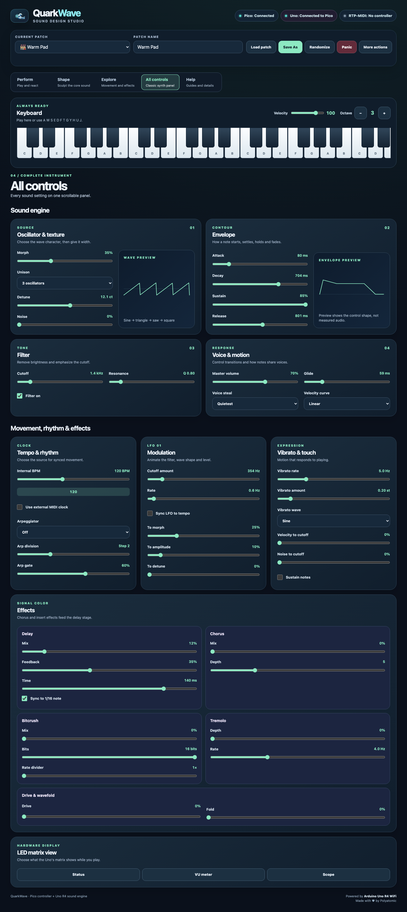
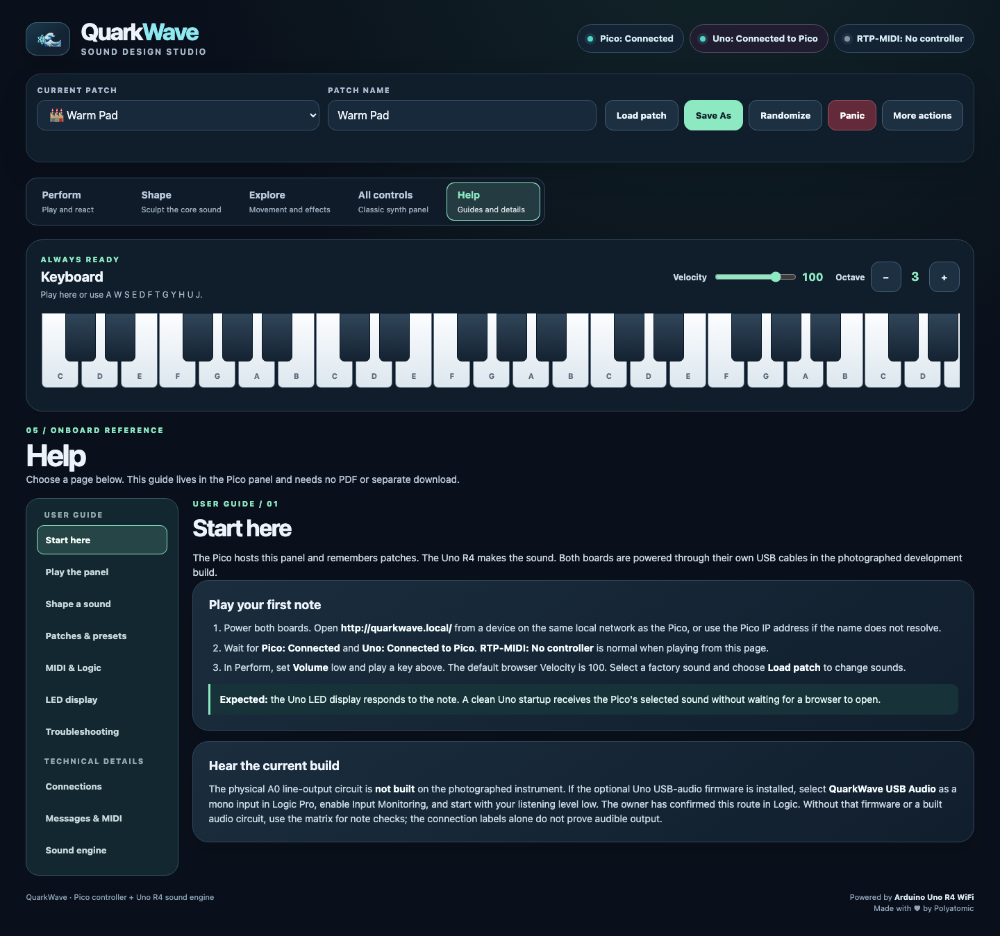
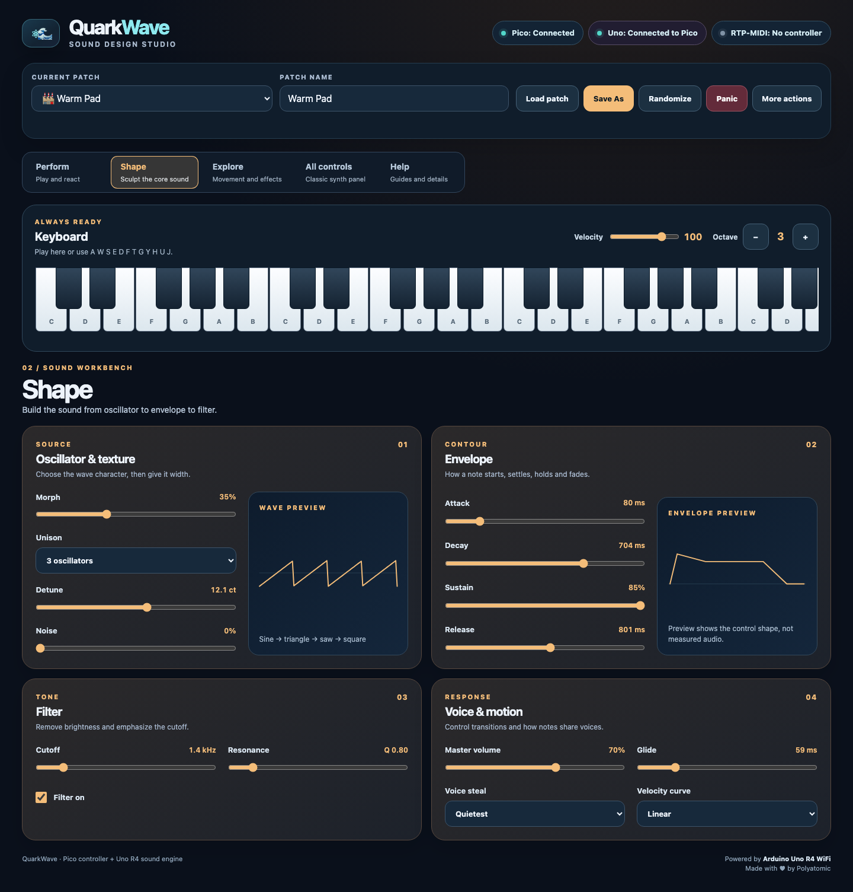
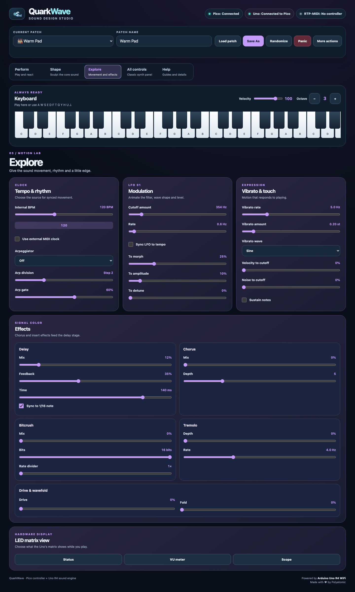
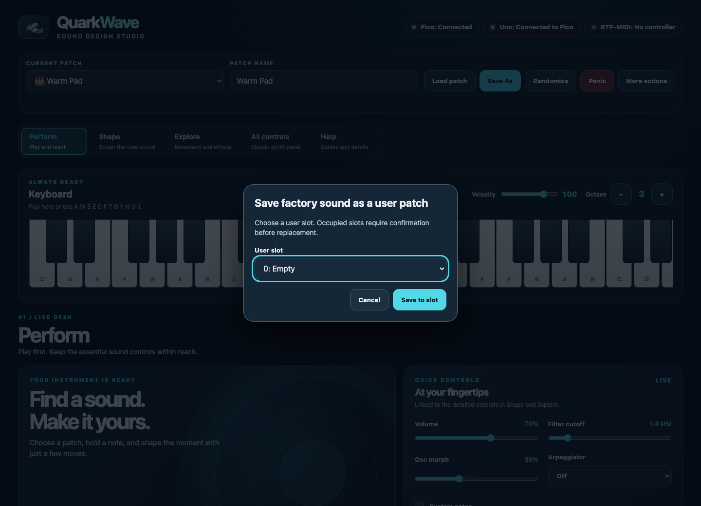

# QuarkWave MIDI: musician guide

**For:** development testers with an assembled Pico W web controller and Uno R4 sound module.  
**Status:** source-reviewed, partial two-board check (firmware snapshot: 2026-09-23). If a step differs on your unit, record it in [Documentation gaps](documentation-gaps.md).

QuarkWave is a four-voice digital synthesizer. The Pico W hosts the browser panel and remembers patches; the Uno R4 makes the sound. The browser's keyboard and controls reach the Uno through the Pico. The Uno also has separate MIDI inputs. Start with the [quick start](quick-start.md) if this is your first session. The [sound-design lessons](sound-design.md) provide guided listening exercises; the [external MIDI guide](external-midi-guide.md) covers playing the Uno without the browser, and [Network MIDI setup](network-midi-setup.md) explains Mac, Windows, and Logic Pro connections. See the [technical guide](technical-guide.md) for message details.

## Get connected and play a note

1. Power both boards. If the optional Uno USB-audio build is installed, use its [mono input in Logic Pro](network-midi-setup.md#record-the-sound-while-playing-from-the-pico-page) at a low listening level. The photographed build has no physical A0 line output yet; without the USB-audio build, use the Uno LED matrix to check note activity while the [proposed line stage](connection-guide.md#proposed-mono-line-output-from-uno-a0) remains unbuilt.
2. Put your phone or computer on the same Wi-Fi network configured for the Pico W. Open `http://quarkwave.local/`. If the name does not resolve, ask the tester or builder for the Pico's IP address and open `http://<Pico-IP>/`.
3. Wait for **Pico: Connected** and **Uno: Connected to Pico**. The first label confirms the browser connection to the Pico. The second means the Uno answered the Pico and acknowledged the selected sound settings. The separate **RTP-MIDI** label shows whether a wireless controller has joined the Pico session; it can say **No controller** while the browser keyboard works. These labels do not verify the audio path.
4. Play the on-screen keyboard. You can also use the computer keys **A W S E D F T G Y H U J** while focus is outside text fields. Use **−** and **+** beside the keyboard to change its octave. Set **Velocity** from 1 to 127 beside the keyboard; the number is the MIDI Note On velocity for the next note. To choose another sound, select a patch and choose **Load patch**.

**Expected from source:** the Pico sends note-on and note-off messages to the Uno. Closing a browser connection releases notes held by that connection. The browser keyboard starts at velocity 100 on each page load. Changing it affects new pointer, on-screen key, and computer-key notes; notes already held keep their original velocity. Computer-note keys still work while the Velocity slider has focus. This setting is not saved with a patch. Sound and level remain hardware checks. [Browser keyboard](../QuarkWave_UI_MIDI/QuarkWave_UI.h), [Pico note handling](../QuarkWave_UI_MIDI/QuarkWave_UI_MIDI.ino).

If the Uno label says **Connected to Pico · standalone sound**, it has received notes or controls from another MIDI input. Its current sound is left alone. See [Take over a standalone sound](#take-over-a-standalone-sound) if you want the Pico's selected sound instead. If either connection is missing, see [When something goes wrong](#when-something-goes-wrong).

## Find your way around the panel

The Perform, Shape, Explore, All controls, Help, and Save As images are source-rendered simulations with a connected status and Warm Pad values. They show control locations, not a live post-upload check or audible sound. The Save As dialog was opened without writing a patch.

*Perform: keep the keyboard, patch actions, volume, cutoff, morph, arpeggiator and sustain within reach.*

| Area | What it does |
| --- | --- |
| **Patch and connection strip** | Stays at the top in every view. Separate labels show the browser–Pico and Pico–Uno connections. Selects one of eight user slots (`0–7`) or a read-only factory sound. **Load patch** sends the chosen sound to the Uno; **Save patch** writes a user slot on the Pico. With a factory sound selected, the button becomes **Save As**. **Randomize** is beside the patch buttons. **More actions** contains Commit snapshot, Load committed sound, and Sync Pico patch to Uno. |
| **Perform** | Large keyboard and quick controls for volume, cutoff, morph, arpeggiator and sustain. Choose this view for playing. |
| **Shape** | Oscillator and texture, envelope, filter, then voice response. Waveform and envelope drawings preview control settings. |
| **Explore** | Tempo, arpeggiator details, LFO routing, vibrato, effects and Uno LED matrix views. |
| **All controls** | Puts the Shape and Explore controls on one scrollable page, like a classic synth panel. Use it when programming across several sections. |
| **Help** | Opens ten onboard pages: Start here, Play the panel, Shape a sound, Patches & presets, MIDI & Logic, LED display, Troubleshooting, Connections, Messages & MIDI, and Sound engine. The text is built into the Pico page, so it needs no PDF or separate download. |
| **Keyboard** | Stays mounted while you switch views; plays notes from the page or computer keys. Octave buttons and the 1–127 Velocity control are beside it. |

Select **Perform**, **Shape**, **Explore**, **All controls**, or **Help** to change the layout. The selected view is remembered in this browser; it is not part of the patch. The sound and held notes continue across view changes, including Help. All controls moves the same sound controls onto one page, so their values do not reset when you switch back. The Uno's 12×8 LED matrix can show **Status**, **VU meter**, or **Scope** from Explore or All controls. Status shows four voice bars; VU shows several recent loudness bars for the mono sound; Scope shows a moving trace. Those buttons select its display mode; they do not change the sound. The [Uno LED display guide](led-display-guide.md) explains the top-row status lights and each view. **Panic** stays in the top strip and sends All Sound Off if a note hangs. [Panel and view switching](../QuarkWave_UI_MIDI/QuarkWave_UI.h), [Pico message handler](../QuarkWave_UI_MIDI/QuarkWave_UI_MIDI.ino).

*All controls: one scrollable work surface for the full instrument. The patch strip and keyboard remain above the controls.*

*Help: choose a topic page without leaving the instrument. The Markdown guides retain the detailed build schematics and complete protocol tables; the PDF editions are not served by the Pico.*

## Build a sound

*Shape: follow the sound from oscillator and envelope to filter and voice response. The drawings preview settings rather than measured audio.*

Start with a loaded patch and make one change at a time. The [patch book](patch-book.md) describes all eight factory sounds and gives five suggested variations to try. These are exploratory steps; the audible results have not been checked on hardware.

1. In **Shape**, adjust **Morph** while holding a note. It moves among the Uno's oscillator shapes. Use **Unison** to layer up to three oscillators per voice and **Detune** to spread them.
2. Enable **Filter on**. Lower **Cutoff** to remove high frequencies; raise **Resonance** to emphasize the filter's cutoff region.
3. In **Envelope**, lengthen **Attack** for a slower start, or lengthen **Release** for a longer fade after you lift the key.
4. Add a little **Glide** for pitch movement between notes, or **Noise** for a noise layer. Adjust **Master volume** at a comfortable level. The quick volume, cutoff and morph controls in Perform adjust these same settings.
5. Play short and long notes to compare the result. Try keyboard **Velocity** at 1, 100, and 127 to hear the response of new notes. Save only when you want to keep the current sound settings.

QuarkWave has four note voices. When more notes are requested, the selected **Voice Steal** mode decides which voice makes room. **Velocity Curve** changes how strongly note velocity affects level. [Uno voices](../QuarkWave_MIDI/QuarkWave_MIDI.ino), [Uno control map](../QuarkWave_MIDI/QuarkWave_MIDI.ino).

## Add movement and rhythm

*Explore: set modulation and rhythm, then add effects. The shared keyboard remains above the controls.*

1. In **Explore**, raise **Cutoff amount** under Modulation, then adjust **Rate**. The first LFO moves filter cutoff; **To morph**, **To amplitude**, and **To detune** add other destinations.
2. Turn on **Sync LFO to tempo** to derive the first LFO rate from the active tempo. Leave **Use external MIDI clock** off and set **Internal BPM**, or enable it for external MIDI clock. An external DIN device, or an RTP device connected to the Pico, must send MIDI Clock; QuarkWave supports 40–240 BPM and gives DIN priority when both inputs send clock. If pulses stop, the last tempo continues. External timing has not been hardware-tested here.
3. Use **Velocity to cutoff** to make harder playing brighten the filter. **Noise to cutoff** adds random movement.
4. Use **Vibrato rate**, **Vibrato amount**, and **Vibrato wave** to add movement. The wave can be sine, triangle, or square.
5. For repeated notes, select an **Arpeggiator** mode and hold notes. **Arp division** changes step spacing; **Arp gate** changes note length. With external clock selected, MIDI Start resets the pattern to its first step, Continue resumes it, and Stop releases its sounding step while keeping held keys. Turn the mode off to return to normal held-note playing. The same mode selector is available in Perform.

**Sustain** holds released notes until it is turned off. The synth also accepts MIDI sustain pedal CC64. [Uno modulation and arpeggiator](../QuarkWave_MIDI/QuarkWave_MIDI.ino), [Uno sustain](../QuarkWave_MIDI/QuarkWave_MIDI.ino).

## Use effects

| Effect | Try this | What the source implements |
| --- | --- | --- |
| **Chorus** | Raise **Mix**, then adjust **Depth**. | Two moving delayed taps blended with the dry signal. |
| **Delay** | Raise **Mix**, adjust **Time** and **FB**. | An echo with feedback; **Sync (1/16)** sets time to a sixteenth note of the active tempo. |
| **Bitcrush** | Raise **Mix**, then lower **Bits** or change **Rate**. | Quantization and sample holding for a grainier sound. |
| **Tremolo** | Raise **Depth**, then set **Rate**. | Periodic level movement. |
| **Drive / Fold** | Raise each control gradually. | Saturation and wavefolding before the bitcrush and tremolo stages. |

The source places chorus, drive/fold, bitcrush, and tremolo before delay. Use modest settings first because combined effects can change level substantially. [Uno audio path](../QuarkWave_MIDI/QuarkWave_MIDI.ino).

## Explore a random sound

1. Set a comfortable listening level, then choose **Randomize** in the patch strip.
2. Wait for the panel controls to update. Play a new note to hear the new live sound; Randomize can use the full range of each effect and volume control.
3. Adjust the result, then save it to a user slot if you want to keep it. Changing patches before saving discards the random sound.

**Expected from source:** the browser sends one `randomize` request. The Pico chooses values within the Uno's MIDI limits, sends the patch to the Uno, and returns `patchData` for the panel. It leaves the selected patch slot, sustain-pedal state, and keyboard Velocity alone. Audible results remain hardware untested. [Pico Randomize](../QuarkWave_UI_MIDI/QuarkWave_UI_MIDI.ino), [browser action](../QuarkWave_UI_MIDI/QuarkWave_UI.h).

## Save, load, and recover patches

1. Choose an empty user slot numbered `0–7`, enter a name of up to 16 characters, and select **Save patch**. The Pico creates a patch file for that slot. Selecting an occupied user slot and choosing **Save patch** updates that slot.
2. Select that slot and choose **Load patch** to send its stored settings to the Uno. The Pico remembers the last loaded factory or user patch for the next boot.
3. To keep a separate snapshot of the current sound, open **More actions** and select **Commit snapshot**. **Load committed sound** restores that snapshot from the Pico's separate commit file. The strip reports the Pico's confirmation.
4. To explore, select a factory preset from the [patch book](patch-book.md#factory-presets) and choose **Load patch**. Factory sounds appear after the user slots and cannot be overwritten. To keep an edited factory sound, enter a name, choose **Save As**, select a user slot in the dialog, and choose **Save to slot**. If that slot is occupied, confirm the replacement. The panel reports whether the save succeeded.

*Save As requires a user-slot choice. The example shows that legacy `P0` and unreadable files are occupied; neither is treated as empty by its name.*

**Save** writes the Pico's current patch data. Controls changed outside the browser may not be reflected in that data. The Uno does not store these patch files. [Patch loading](../QuarkWave_UI_MIDI/QuarkWave_UI_MIDI.ino), [patch writing](../QuarkWave_UI_MIDI/QuarkWave_UI_MIDI.ino), [commit handling](../QuarkWave_UI_MIDI/QuarkWave_UI_MIDI.ino).

## Take over a standalone sound

**Source-reviewed, hardware untested.** The Uno can be played through its separate DIN input without the Pico. RTP-MIDI is available when the optional Pico is attached and powered. If it has received notes or controls, the browser reports **Uno: Connected to Pico · standalone sound** and the Pico does not replace its sound automatically. MIDI clock and transport messages alone do not count as standalone activity. External devices can also send QuarkWave sound Program Changes and SysEx; accepted sound commands count as standalone activity.

1. Stop playing and release held notes on the external controller.
2. In the browser, open **More actions** and choose **Sync Pico patch to Uno**.
3. Read the warning, then confirm if you want to reset the Uno and replace its current sound and held notes with the Pico's current patch.
4. Wait for **Uno: Connected to Pico**. If the panel reports **Sound sync failed**, check the return connection and try again.

**Expected from source:** the Pico sends a reset and full patch transfer, then waits for the Uno to acknowledge it. Loading a patch or committed sound is another explicit way to change the Uno's sound. [Pico sync](../QuarkWave_UI_MIDI/QuarkWave_UI_MIDI.ino), [Uno status](../QuarkWave_MIDI/QuarkWave_MIDI.ino).

## When something goes wrong

| Symptom | First check |
| --- | --- |
| `quarkwave.local` does not open | Confirm the Pico is powered and on the configured Wi-Fi. Try its IP address. The firmware does not provide a browser Wi-Fi setup flow. |
| **Pico: Not connected** | The browser has not connected to the Pico's WebSocket service on port `8081`. Reload the page and check the Pico's Wi-Fi connection. |
| **Uno: Not connected to Pico** | The Pico has not received a handshake reply. Ask the builder to check Uno power, both UART wires, common ground, and the level shifter on Uno TX → Pico RX. |
| Both labels show connected, but no sound | Check the listening level and assembled audio connection. The handshake confirms a firmware response, not audio output. |
| **Uno: Connected to Pico · standalone sound** | An external DIN or RTP controller has sent notes or controls. Continue playing that sound or use **Sync Pico patch to Uno** for an explicit takeover. |
| **Uno: Sound sync failed** | The Uno did not confirm the sound transfer after one retry. Check the return wire and use **Sync Pico patch to Uno** again. |
| Note continues after release | Select **Panic**. This sends MIDI CC120, All Sound Off, and clears notes tracked by the Pico for browser clients. |
| Patch seems different after restart | On a clean Uno startup, the Pico should send its selected boot patch once the Uno replies, even before the browser opens. If the Uno reports standalone sound, its external-controller settings take precedence until you explicitly sync. |
| **Save As** reports a failure | Check the named user slot and try again. An unreadable existing file counts as occupied; preserve it for the builder rather than assuming the slot is empty. |

For any mismatch, record the firmware snapshot, which board was powered, the selected patch, the exact steps, and what happened. Do not treat a source-reviewed procedure as a passed hardware test.
